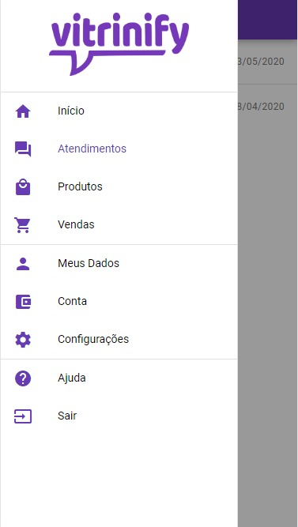
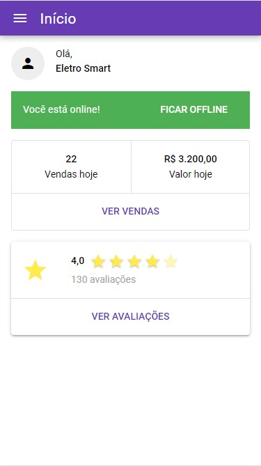
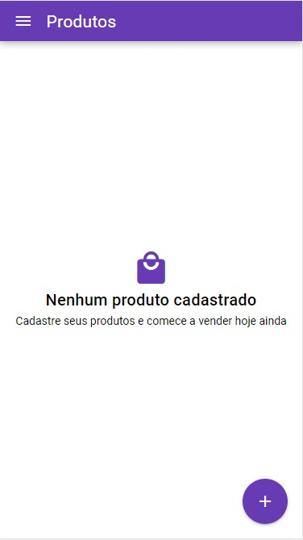
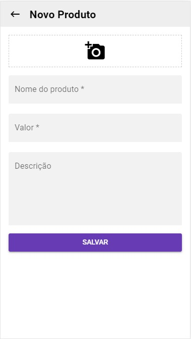
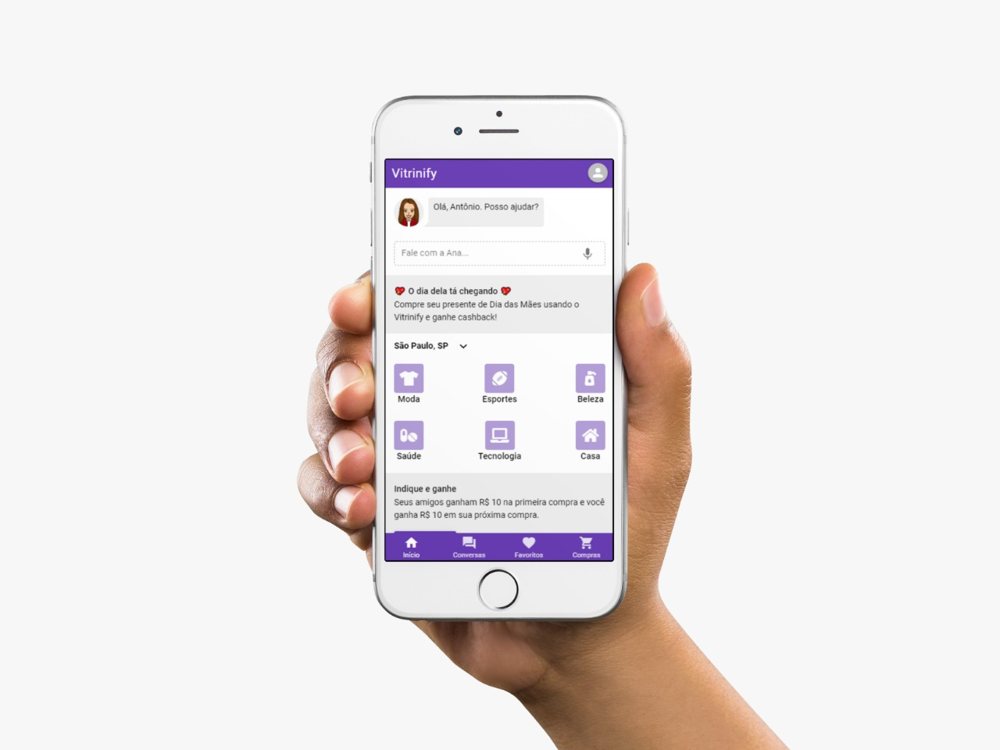

<strong>Equipe 6 (Desafio VTex) 🚀🚀 </strong>

    

<strong>Desafio</strong>

A Pandemia do corona vírus nos trouxe diversos desafios paralelo ao da saúde, e isso é o
que torna essa crise ainda mais complexa.
Um dos setores mais afetados é o de varejo. Com grande estoque parado e uma forte
redução em suas vendas de forma inesperada, força de trabalho e de consumo estão dentro
de casa sem poder sair devido à quarentena e problemas logísticos para garantir que exista
distribuição e reposição de estoque. Um cenário complexo para ser resolvido de forma
rápida para que empresas não deixem de existir.
Como resolver essa equação e trazer agilidade, tecnologia e novas formas de comercializar?
O varejo online é um caminho, sim. Mas como realizar isso de forma criativa e transformar o
varejo em algo novo? Sabemos que o novo normal está aí. Como vamos encará-lo?

<a href="https://drive.google.com/file/d/1WNGu_fpm0zCrIDMYiimbHegB6lNbAjZW/view">Vídeo Pitch</a>

<a href="https://docs.google.com/presentation/d/1MrwMVVah3dfglik2Re8RXUDxUNZEzLzppvW3nkC5TCI/edit#slide=id.gc6f80d1ff_0_0">Apresentação Desafio Vtex</a>

<strong>Código da API desenvolvida na participação do Megahackton da Shawee</strong>

Para executar o projeto: 

<code>git clone</code>: https://github.com/wesleyheron/megahack2020.git

Navegue até a pasta criada que contém os arquivos clonados do repositório: <code>cd megahack2020</code>

<code>npm install</code>

<code>node server.js</code>

As calls para a <code>API localhost</code> podem ser feitas importando a collection no postman: https://www.getpostman.com/collections/941f3ce9eefaa4203738

<a href="https://github.com/alissonmartineli/vitrinify-empresas">Repositório app</a>

Imagens do app <code>vitrinify</code>

 
 

